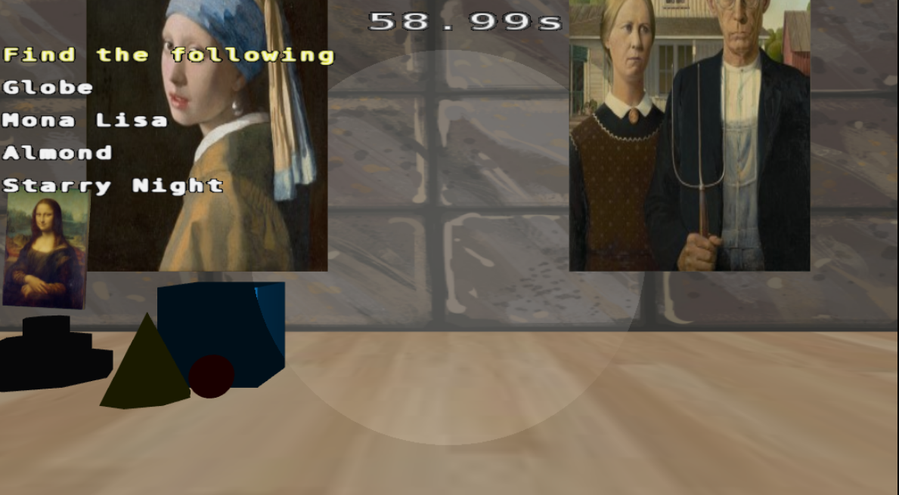
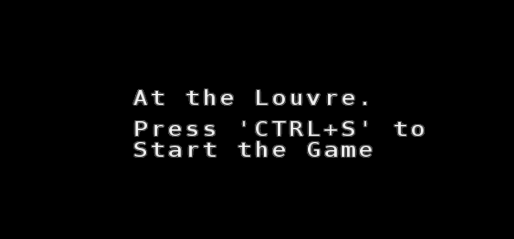

# At-the-Louvre
A Project for CS 174A



## About
Our game takes place during the night at the Louvre. The player is named NICOLAS CAGE and he's looking for specific "art" pieces within the museum. (That is, anything can be a form of art). He's only got a flash light and the list of pieces he needs to find. The time is ticking before the security guard comes back.

## How to run the game
Run host.command to start the server on port 8000, then navigate to localhost:8000 on a web-browser.
- for MacOS: run './host.command'
- for Windows: run 'host.bat' <br>

## Playing the game

- Press 'Ctrl + s' to start the game
- Use basic controls defined below to move and rotate as you fit
- On the left side of the spotlight, there's a list of objects to find before the timer runs out
- Mission: To find all the pieces before the 60 second timer. Good luck!

## Basic Controls
```
W           move forward
A           move left
D           move right
S           move back

Mouse       camera control/look direction

c           tilt UP
z           tilt DOWN

Ctrl + s    Start
Ctrl + p    Pause/Un-pause
Ctrl + r    Restart
Ctrl + o    Return To Initial Position (Bugged)

## Advanced Features

### Collision detection with a little physics
The player is restricted in their movement within the margin (four walls). Whenever the user attempts to move past the margin, there's a small "thrust" (push-back) that is applied in the opposite direction. We accomplished this by constructing a position array that keeps track of object's position in the room. We calculate the distances of our camera to each object's position using the position array.
Key part of our game is to find objects inside the museum, thus our collision also serves as the object found detection system. We set the objects to be "found" when the player goes near the object.

